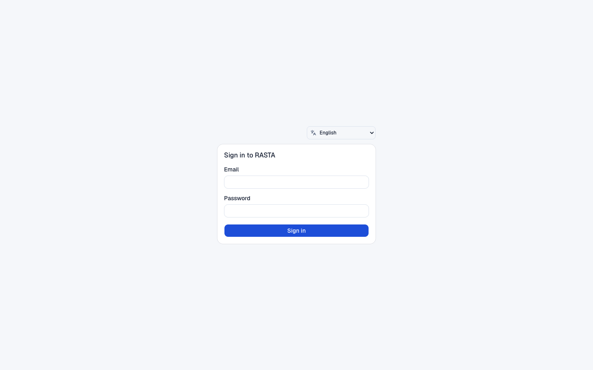
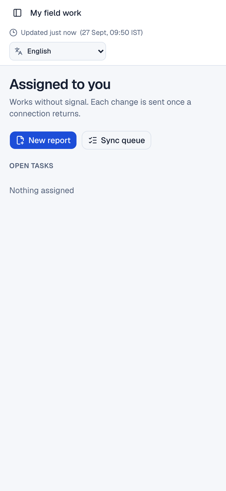
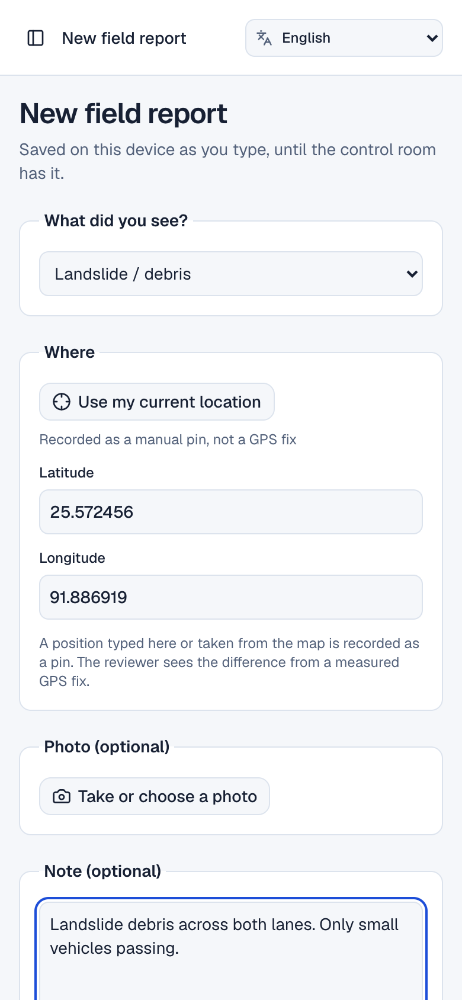
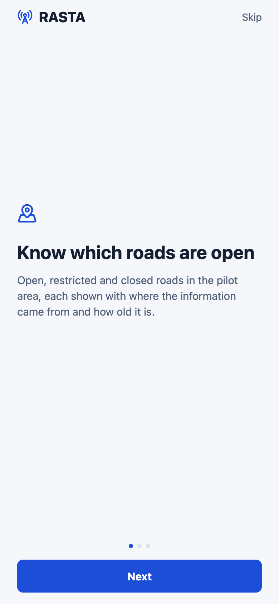

# RASTA (रास्ता)

**Road Accessibility & Supply Tracking Assistant**

A logistics and accessibility intelligence platform for the North Eastern Region
of India. RASTA links a field officer's report of a blocked road to the
deliveries, trips and facilities it affects, so district teams can reroute
essential supplies before a disruption turns into a shortage.

| | |
|---|---|
| **Team name** | Side Quest |
| **Team ID** | 127269 |
| **Team leader** | Arav Arun |
| **College** | Somaiya Vidyavihar University |
| **Problem statement** | SIH26002: AI-Based Smart Logistics and Accessibility Intelligence Platform for North Eastern Region (NER) |
| **Organisation** | Ministry of Development of North Eastern Region (MDoNER) |
| **Theme / category** | Transportation & Logistics / Software |

## The problem

Landslides, floods and heavy rain cut roads across the North Eastern Region
every monsoon. When that happens, medicines, food, agricultural produce and
construction material stop moving, and district officials find out through
phone calls and scattered messages. There is no single place that shows which
roads are open, which trips are affected, which facilities have been cut off
and what route a truck can still safely take.

## How RASTA works

```
Report  ->  Verify  ->  Replan  ->  Acknowledge  ->  Deliver
```

1. A field officer photographs a blocked road. The report is saved on the phone
   with its GPS position, accuracy and time, and sent when there is a network.
2. A district dispatcher reviews the evidence and confirms or rejects it. Only a
   confirmed decision changes a road's status.
3. The closure withdraws every approved route that used the road, alerts the
   people concerned and flags any facility that has lost its last connection.
4. The dispatcher plans a new route for the vehicle, compares the options and
   approves one.
5. The driver acknowledges the new route before following it, and the receiving
   facility records what actually arrived.

Weather forecasts and disaster alerts feed a separate risk score. A road can be
open now and high risk later; RASTA shows both and never lets a forecast pass
itself off as a confirmed closure.

## Features

Mapped to the problem statement's requirements (a) to (h).

| Requirement | What RASTA provides |
|---|---|
| **(a) Road and bridge accessibility** | GIS accessibility map of the pilot road network with each road's status (open, restricted, closed, unknown), its source and how old it is. Bridge weight and height limits are part of the graph. |
| **(b) Disruption prediction** | An explainable risk engine (`baseline-v1`) that scores each road from IMD rainfall forecasts, NDMA SACHET (CAP) warnings and confirmed incidents. Every score lists the inputs behind it, and stale inputs count as missing, not as zero. |
| **(c) Alternate routes and delays** | Constrained route planning (Dijkstra) that excludes closed roads and bridges the vehicle cannot use, offers up to three genuinely different alternatives with ETA ranges, and explains a "no route" result instead of drawing a line across a mountain. |
| **(d) GPS tracking of essential goods** | Trip-scoped tracking: the driver starts and stops it, positions are queued offline and uploaded in batches, and the control room sees stale vehicles clearly. |
| **(e) Automated alerts** | Alerts for road closures and restrictions, withdrawn routes and isolated facilities, with de-duplication, per-person acknowledgement and optional web push. |
| **(f) Geo-tagged field reports** | Photo, location, accuracy and time captured on the phone or in the browser, uploaded to private storage and checked against a SHA-256 checksum before it counts as evidence. |
| **(g) Central dashboards** | District connectivity overview, deliveries (requests, consignments, receipts, shortfalls), fleet positions, incidents, inspections, alerts and data health. |
| **(h) Multilingual and offline** | Web interface in English and all 22 Eighth Schedule languages, drafted with Sarvam Translate. Offline outbox with safe retries, conflict handling, cached routes and downloadable map data packs. |

Supporting the expected solution:

- **Integrations:** IMD and SACHET source adapters, OpenStreetMap import, and a
  versioned OpenAPI contract for other government systems.
- **Security:** Supabase Auth (JWT), organisation and district scope on every
  request, row-level security in PostgreSQL, private evidence storage, an audit
  trail, rate limits, a strict Content Security Policy and location-history
  retention.
- **Human control:** officials approve every route and every road-status change;
  drivers acknowledge every reroute.

## Who uses it

| Role | Main job | Interface |
|---|---|---|
| State coordinator | Cross-district overview and coordination | Web control room |
| District dispatcher | Review incidents, assign inspections, plan and approve routes, manage deliveries | Web control room |
| Field officer | Inspect roads, file geo-tagged reports | Mobile app or web (PWA) |
| Driver | Accept trips, follow approved routes, share location, confirm delivery | Mobile app or web (PWA) |
| Administrator | Manage users, devices and data sources | Web control room |

## Screenshots

From the local demo (`python3 scripts/local_demo.py up`): the pilot road
network from OpenStreetMap, with a synthetic consignment, vehicle and trip.

### Control room (web)

<table>
  <tr>
    <td align="center"><br />Sign-in</td>
    <td align="center"><br />Overview</td>
  </tr>
  <tr>
    <td align="center"><br />Accessibility map</td>
    <td align="center"><br />Route planner with ranked options</td>
  </tr>
  <tr>
    <td align="center"><br />Field report under review</td>
    <td align="center"><br />Deliveries: manifest, trip and receipt</td>
  </tr>
  <tr>
    <td align="center"><br />Fleet and trips</td>
    <td align="center"><br />Data health</td>
  </tr>
  <tr>
    <td align="center"><br />The same overview in Hindi</td>
    <td></td>
  </tr>
</table>

### Field PWA (web)

<table>
  <tr>
    <td align="center"><br />Assigned tasks</td>
    <td align="center"><br />New field report, saved on the device as it is typed</td>
  </tr>
</table>

### Mobile app

<table>
  <tr>
    <td align="center"><br />Introduction</td>
    <td align="center"><br />Driver: approved route</td>
    <td align="center"><br />Driver: load and position reporting</td>
  </tr>
  <tr>
    <td align="center"><br />Observer: report a disruption</td>
    <td align="center"><br />SOS and helplines</td>
    <td></td>
  </tr>
</table>

## Accounts and sign-in

There is no public sign-up. Every account is issued with one role and a district
scope (a Supabase Auth user, a profile and a role grant), and the API checks both
on every request.

- **Web:** email and password, then the server confirms the profile, role and
  district (`/v1/me`) before any screen opens.
- **Mobile app:** the same account. The seat comes from its role: `driver` opens
  the driver seat and `field_officer` the observer seat. Control-room roles are
  refused on the phone. Without an account the app runs local-only: reports stay
  on the phone and never reach the control room.
- **Local demo:** `scripts/local_demo.py up` creates the demo accounts through
  the Supabase admin API (`scripts/lib/identities.py`) and lists them in
  `artifacts/demo/accounts.json`.

## Architecture

```
  Web control room and field PWA (React, MapLibre)
  Mobile app for field officers and drivers (Expo / React Native)
                 |
                 |  HTTPS + JSON, Supabase JWT
                 v
  RASTA API (FastAPI)
    incidents and evidence review    constrained route planning
    road state and risk engine       logistics, trips, receipts
    alerts and web push              telemetry, audit, retention
                 |
                 v
  PostgreSQL + PostGIS (Supabase)      Private evidence storage
  road graph, facilities, trips,       photos with checksums
  audit events, versioned state
                 ^
                 |
  Inputs: OpenStreetMap road graph, IMD rainfall, NDMA SACHET alerts,
          field reports, trip GPS
```

## Tech stack

| Layer | Technology |
|---|---|
| Web client | React 19, TypeScript, Vinext, MapLibre GL, TanStack Query, Tailwind CSS, Dexie (IndexedDB) |
| Mobile app | Expo, React Native, Expo Router, Expo Location, AsyncStorage |
| API | Python 3.12+, FastAPI, Pydantic, psycopg |
| Database and auth | Supabase (PostgreSQL, PostGIS, Auth, Storage, pg_cron) |
| Maps and data | OpenStreetMap, Overpass API |
| Testing | pytest, Vitest, Playwright, axe-core |

Every part of the stack is open source or free, and the demo needs no paid
service.

## Pilot data

The pilot covers central **Shillong, East Khasi Hills, Meghalaya**.

- **Road graph:** 1,236 nodes and 2,860 directed road segments from
  OpenStreetMap, with 30 health, pharmacy, market and warehouse facilities.
- **Weather and alerts:** recorded IMD and SACHET samples exercise the
  adapters. They are labelled as recorded on every screen.
- **Scenarios:** six synthetic scenarios (normal delivery, confirmed closure,
  forecast-only risk, isolated facility, duplicate GPS upload, bridge limit), all
  labelled `SIMULATED SCENARIO`.

Every value on screen is marked as live, recorded or synthetic.

## Repository layout

```
apps/
  client/               Web control room and field PWA (React, Vinext, MapLibre)
  mobile/               Field officer and driver app (Expo, React Native)
api/                    FastAPI backend and its unit tests
supabase/               Migrations, seed data and schema checks
contracts/              Generated OpenAPI schema and TypeScript types
data/                   Pilot road graph, facilities, scenarios, recorded samples
Screenshots/            Screenshots used in this README
scripts/
  local_demo.py         One-command local demo
  pipeline/             Build and validate the pilot data
  tools/                Contracts, schema check, secret scan, translations, retention
  ml/                   Risk model label audit
  lib/                  Shared helpers for starting the local stack
tests/
  e2e/                  Playwright specs and the runners that start the stack
  integration/          Checks against a freshly reset local stack
  scripts/              Unit tests for the scripts
```

## Getting started

Requirements: Docker, the [Supabase CLI](https://supabase.com/docs/guides/local-development),
Node 22 and Python 3.12 or newer.

```bash
npm ci
python3.12 -m venv api/.venv
api/.venv/bin/python -m pip install -e './api[dev]'
python3 scripts/local_demo.py up
```

`up` starts Supabase, resets the database, imports the pilot network, creates
the demo accounts, starts the API and the web client, and seeds the demo story.
It prints the sign-ins (with a fresh password each time) and the web address.

| Command | What it does |
|---|---|
| `python3 scripts/local_demo.py check` | Pre-demo checks; changes nothing |
| `python3 scripts/local_demo.py reset` | Puts the demo story back to its start |
| `python3 scripts/local_demo.py backup` | Saves the database and evidence files |
| `python3 scripts/local_demo.py restore <dir>` | Restores a backup |
| `python3 scripts/local_demo.py down` | Stops the API and the web client |
| `python3 scripts/local_demo.py up --lan-ip <address>` | Lets a phone on the same Wi-Fi use the demo |

### Mobile app

```bash
cp apps/mobile/.env.example apps/mobile/.env   # fill in the API and Supabase URLs
npm run mobile:start
```

Use the laptop's LAN address in `.env` when running on a real phone. To install
a build on a connected Android phone (needs Android Studio):

```bash
cd apps/mobile && npx expo run:android
```

## Tests

Unit tests and static checks need no database or network:

```bash
npm run lint && npm run typecheck && npm test
npm run format:check
api/.venv/bin/python -m pytest -q api/tests
api/.venv/bin/python -m ruff check api scripts tests
api/.venv/bin/python -m unittest discover -s tests/scripts
python3 scripts/pipeline/validate_pilot_graph.py
python3 scripts/pipeline/validate_scenarios.py
python3 scripts/pipeline/verify_routing.py
python3 scripts/tools/validate_supabase_schema.py
npm run contracts:check
```

The integration checks (`tests/integration/`) and browser tests (`tests/e2e/`)
each reset the local database and start the services they need. See
[tests/README.md](tests/README.md).

## Languages

The web client ships English plus all 22 languages of the Eighth Schedule:
Assamese, Bengali, Bodo, Dogri, Gujarati, Hindi, Kannada, Kashmiri, Konkani,
Maithili, Malayalam, Manipuri (Meetei Mayek), Marathi, Nepali, Odia, Punjabi,
Sanskrit, Santali (Ol Chiki), Sindhi (Devanagari), Tamil, Telugu and Urdu
([registry](apps/client/i18n/languages.json)). Urdu and Kashmiri render right to
left. The app makes no translation request at runtime: English is the source,
and the other catalogues are drafted with `scripts/tools/translate_catalogues.py`
(Sarvam Translate). Each is marked unreviewed until a native speaker checks it,
and a catalogue is offered only while no more than 5% of it is still in English.

```bash
api/.venv/bin/python scripts/tools/translate_catalogues.py --dry-run
api/.venv/bin/python scripts/tools/translate_catalogues.py
```

A run sends only strings that are new, changed, or left in English by an earlier
failed run, and checks every answer: placeholders and plural forms must survive,
and English given back is not accepted as a translation. Strings a person edited
are never overwritten. The key is read from
`SARVAM_API_KEY` in the environment or the repository's `.env`.

## Current status

The full workflow runs end to end on the local stack: field report, offline
sync, review, road state, alerts, route planning and approval, trips, GPS and
delivery receipts. Still to do:

- Hosted deployment (the demo currently runs locally).
- Live IMD and SACHET access; the adapters run on recorded samples today.
- A native Android background location service. The mobile app tracks while it
  is open.
- Automatic alerts for high-risk corridors and delayed deliveries.
- A trained risk model, once real outcome labels exist. The current score is a
  documented weighting, not a fitted model.
- Native-speaker review of the non-English catalogues.
- An administrator screen for issuing accounts and role grants. Today accounts
  are created through the Supabase admin API.

## Data sources and attribution

- Road and facility data © [OpenStreetMap contributors](https://www.openstreetmap.org/copyright),
  available under the Open Database License. See [data/OSM-NOTICE.md](data/OSM-NOTICE.md).
- Weather and alert formats follow the [IMD API reference](https://api.imd.gov.in/public/api_reference.html)
  and [NDMA SACHET](https://sachet.ndma.gov.in/) (OASIS CAP 1.2).

RASTA is a Smart India Hackathon 2026 submission and is not endorsed by MDoNER,
IMD or NDMA.
