# RASTA (रास्ता)

**Road Accessibility & Supply Tracking Assistant**

A logistics and accessibility intelligence platform for the North Eastern Region
of India. RASTA links a field officer's report of a blocked road to the
deliveries, trips and facilities it affects, so district teams can reroute
essential supplies before a disruption turns into a shortage.

| | |
|---|---|
| **Team name** | Side Quest |
| **Team ID** | 127269 |
| **Team leader** | Arav Arun |
| **College** | Somaiya Vidyavihar University |
| **Problem statement** | SIH26002: AI-Based Smart Logistics and Accessibility Intelligence Platform for North Eastern Region (NER) |
| **Organisation** | Ministry of Development of North Eastern Region (MDoNER) |
| **Theme / category** | Transportation & Logistics / Software |

## Live demo

| | |
|---|---|
| **Website and control room** | https://rasta-client.aravarun.workers.dev |
| **Android app (APK)** | [Download rasta.apk](https://github.com/Arav-Arun/SIH2026_Rasta/releases/latest/download/rasta.apk) |
| **Demo video** | https://youtu.be/d7QWfgCOpME |

On the sign-in page, **Try the demo** signs you in as a dispatcher, field officer
or driver with one click. The server sleeps when idle, so the first request after
a quiet spell can take up to a minute.

## The problem

Landslides, floods and heavy rain cut roads across the North Eastern Region
every monsoon. When that happens, medicines, food, agricultural produce and
construction material stop moving, and district officials find out through
phone calls and scattered messages. There is no single place that shows which
roads are open, which trips are affected, which facilities have been cut off
and what route a truck can still safely take.

## How it works

```
Report  ->  Verify  ->  Replan  ->  Acknowledge  ->  Deliver
```

1. **Report:** a field officer photographs a blocked road. The report is saved on
   the phone with its GPS position, accuracy and time, and sent when there is a
   network.
2. **Verify:** a district dispatcher reviews the evidence and confirms or rejects
   it. Only a confirmed decision changes a road's status.
3. **Replan:** the closure withdraws every approved route that used the road,
   alerts the people concerned and flags any facility that has lost its last
   connection. The dispatcher compares alternate routes and approves one.
4. **Acknowledge:** the driver accepts the new route before following it.
5. **Deliver:** the receiving facility records what actually arrived, and any
   shortfall is flagged.

Weather forecasts and disaster alerts feed a separate risk score. A road can be
open now and high risk later; RASTA shows both and never lets a forecast pass
itself off as a confirmed closure.

## Features

Mapped to the problem statement's requirements (a) to (h).

| Requirement | What RASTA provides |
|---|---|
| **(a) Road and bridge accessibility** | GIS map of the road network with each road's status (open, restricted, closed, unknown), its source and how old it is. Bridge weight and height limits are checked against each vehicle. |
| **(b) Disruption prediction** | An explainable risk engine that scores each road from IMD rainfall forecasts, NDMA SACHET (CAP) warnings, confirmed incidents, terrain slope from SRTM elevation and, where several tracked trips crossed it recently, how slowly vehicles moved (thresholds not yet calibrated on real trips). Every score lists the inputs behind it and the ones that are missing. A training and evaluation pipeline (`ml/`) tests whether a model trained on past landslides beats this baseline on years it never saw; no trained model is in use yet. |
| **(c) Alternate routes and delays** | Constrained route planning that avoids closed roads and bridges the vehicle cannot use, and offers up to three genuinely different routes with ETA ranges. |
| **(d) GPS tracking of essential goods** | Trip-based tracking of vehicles carrying medicines, food, produce and construction material. Positions are queued offline and uploaded in batches. |
| **(e) Automated alerts** | Alerts for road closures and restrictions, withdrawn routes, isolated facilities, stale vehicle positions and delivery shortfalls, with acknowledgement and web push. |
| **(f) Geo-tagged field reports** | Photo, location, accuracy and time captured on the phone or in the browser, stored privately and verified with a SHA-256 checksum. |
| **(g) Central dashboards** | District connectivity overview, deliveries and supply gaps, fleet positions, incidents, inspections, alerts and data health. |
| **(h) Multilingual and offline** | The control room and offline web app in English and all 22 Eighth Schedule languages. Reports, GPS positions, approved routes and map data packs work offline and sync on reconnect. |

Across the platform:

- **Integrations:** IMD and SACHET source adapters, OpenStreetMap import, and a
  versioned OpenAPI contract for other government systems.
- **Security:** Supabase Auth, organisation and district scope on every request,
  row-level security in PostgreSQL, private evidence storage, a full audit
  trail, rate limits and a strict Content Security Policy.
- **Human control:** officials approve every route and every road-status change;
  drivers acknowledge every reroute.

## Who uses it

| Role | Main job | Interface |
|---|---|---|
| State coordinator | Cross-district overview and coordination | Web control room |
| District dispatcher | Review reports, assign inspections, plan and approve routes, manage deliveries | Web control room |
| Field officer | Inspect roads and file geo-tagged reports | Android app or web |
| Driver | Follow approved routes, share location, confirm delivery | Android app or web |
| Administrator | Data sources and system health | Web control room |

Accounts are issued by the administration with one role and one district; there
is no public sign-up.

## Screenshots

Pilot area: central Shillong, East Khasi Hills, Meghalaya.

### Control room

<table>
  <tr>
    <td align="center">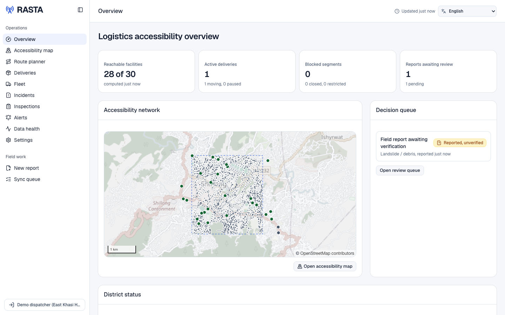<br />Overview</td>
    <td align="center">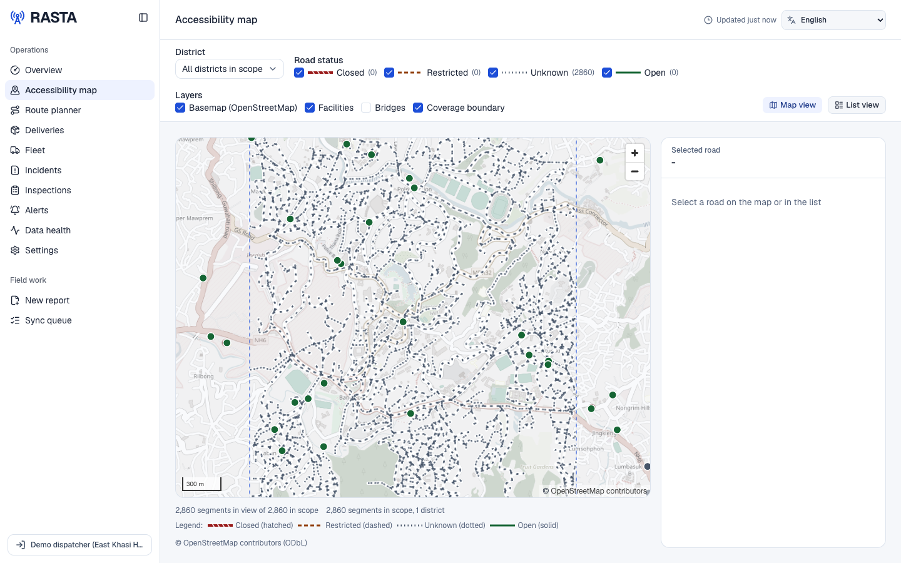<br />Accessibility map</td>
  </tr>
  <tr>
    <td align="center">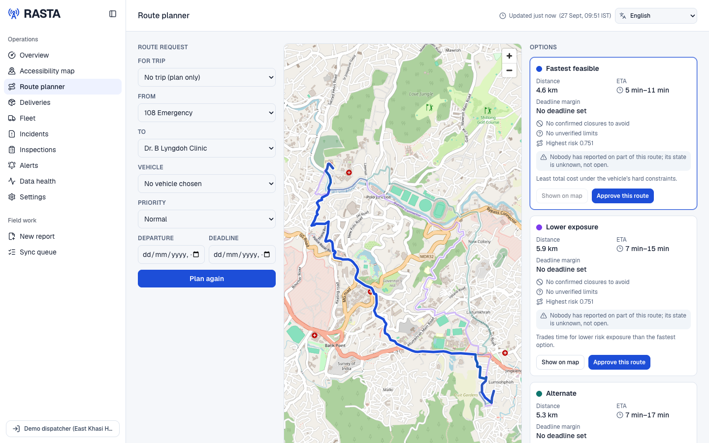<br />Route planner with ranked options</td>
    <td align="center">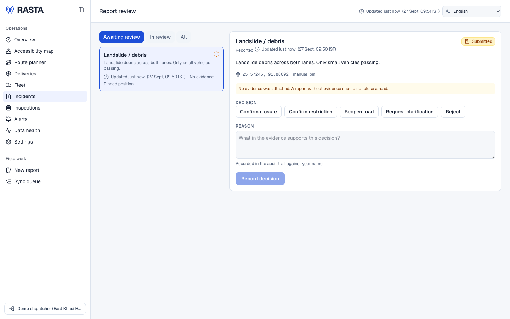<br />Field report under review</td>
  </tr>
  <tr>
    <td align="center">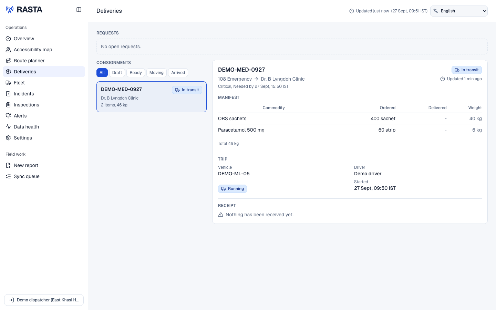<br />Deliveries: manifest, trip and receipt</td>
    <td align="center">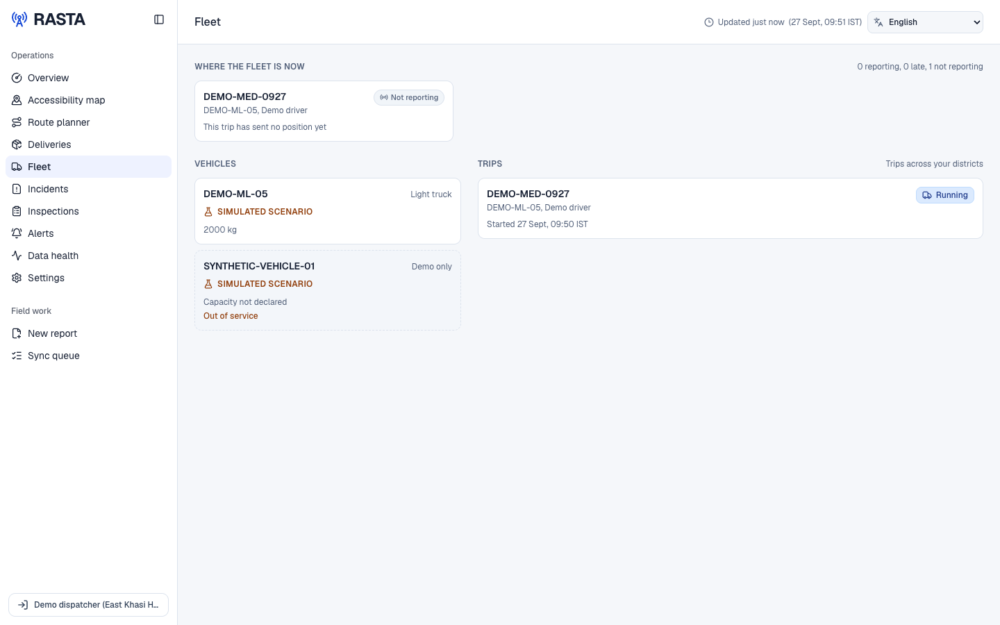<br />Fleet and trips</td>
  </tr>
  <tr>
    <td align="center">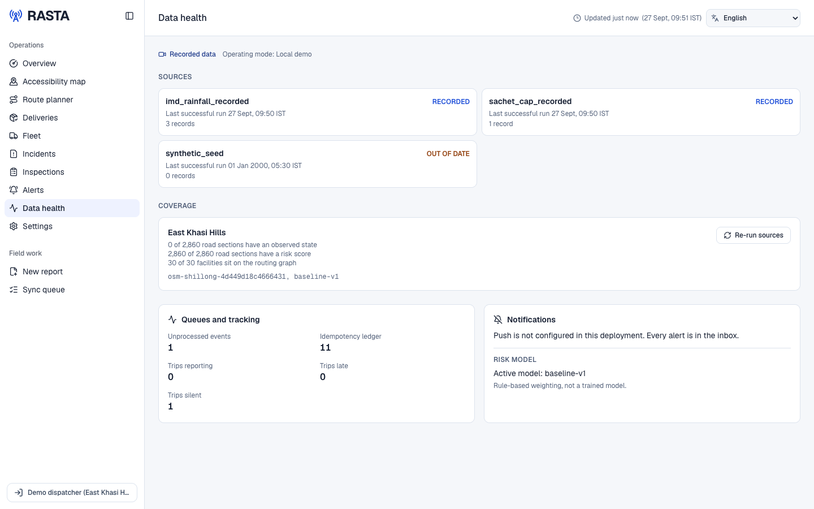<br />Data health</td>
    <td align="center">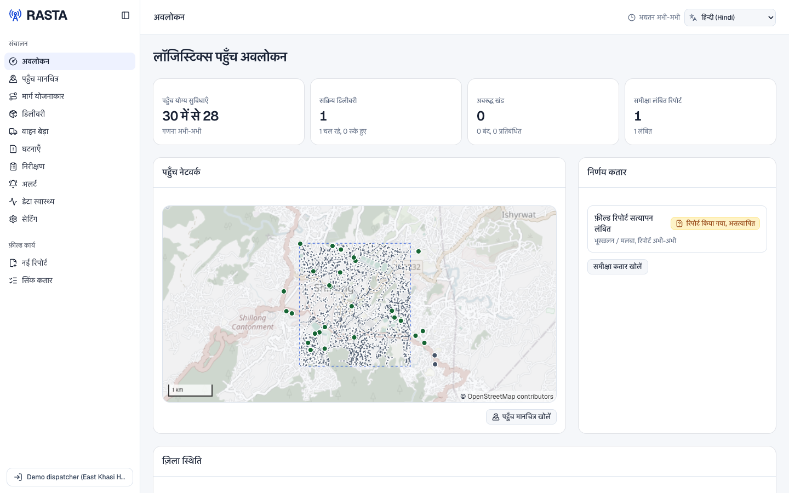<br />The same overview in Hindi</td>
  </tr>
</table>

### Android app

<table>
  <tr>
    <td align="center">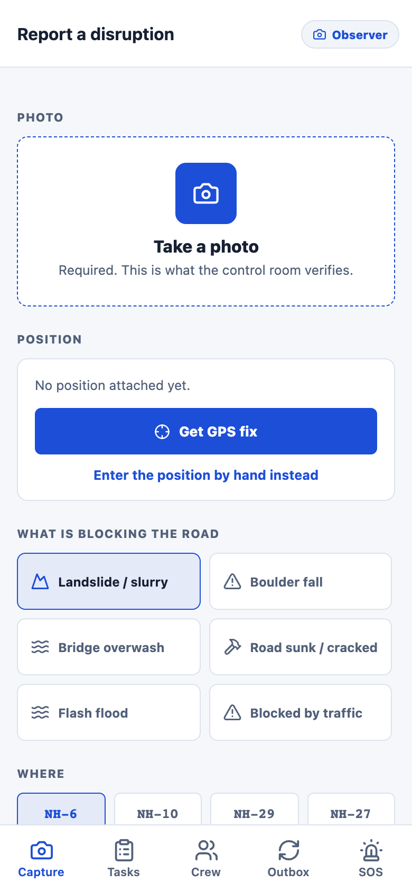<br />Report a disruption</td>
    <td align="center">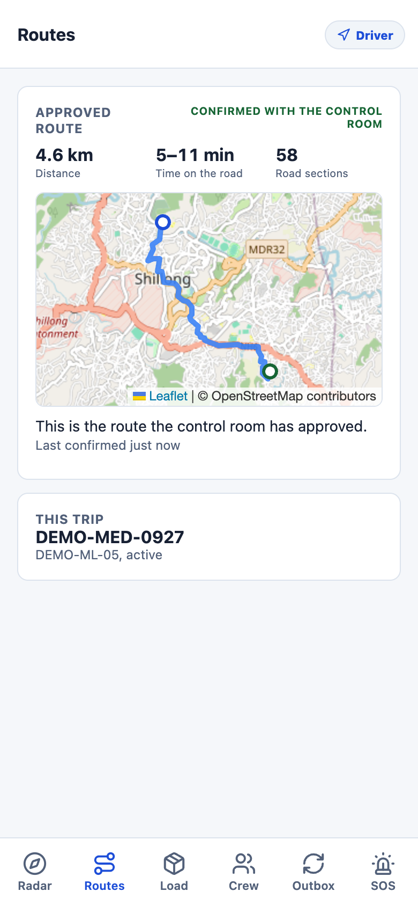<br />Approved route</td>
    <td align="center">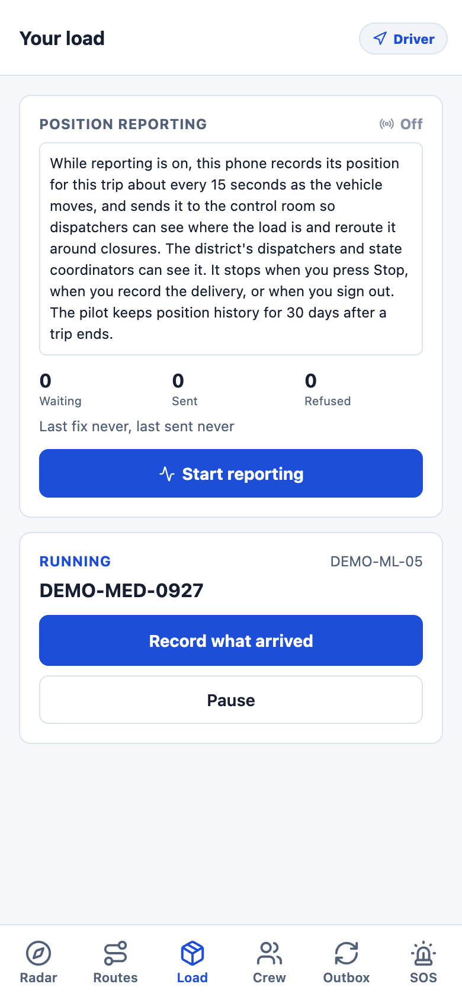<br />Load and position reporting</td>
    <td align="center">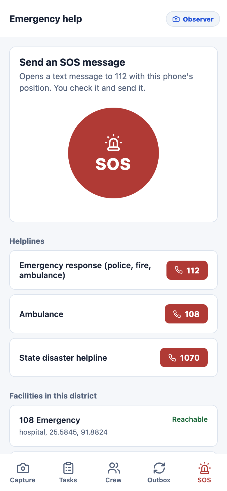<br />SOS and helplines</td>
  </tr>
</table>

## Architecture

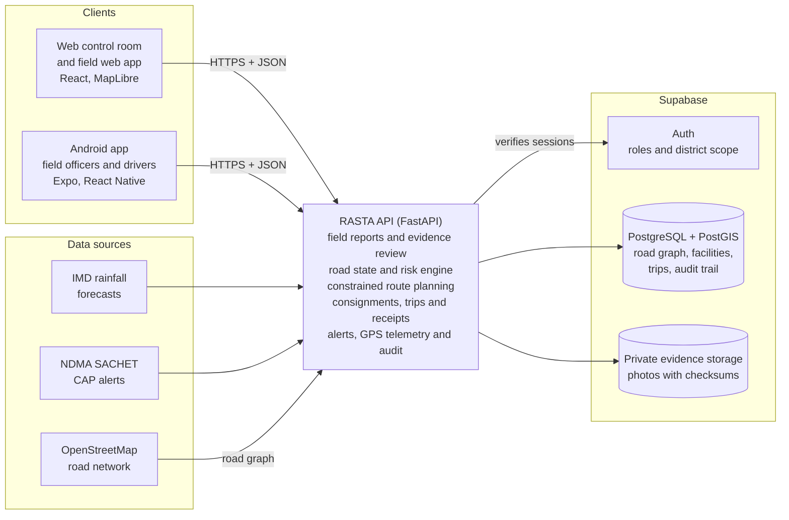

## Tech stack

| Layer | Technology |
|---|---|
| Web client | React 19, TypeScript, Vinext, MapLibre GL, TanStack Query, Tailwind CSS, IndexedDB |
| Android app | Expo, React Native, Expo Router, Expo Location |
| API | Python, FastAPI, Pydantic, psycopg |
| Database and auth | Supabase (PostgreSQL, PostGIS, Auth, Storage, pg_cron) |
| Maps and data | OpenStreetMap, Overpass API |
| Hosting | Cloudflare Workers (web), Render (API), Supabase (database) |

Every part of the stack is open source or free to run.

## Pilot data

- **Road network:** 2,860 road segments in central Shillong, imported from
  OpenStreetMap, with 30 health, pharmacy, market and warehouse facilities.
- **Terrain:** the slope of the ground around each of those road segments, computed
  from SRTM elevation (`data/sources/build_terrain.py`).
- **Weather and alerts:** IMD rainfall and NDMA SACHET adapters. Until live feed
  access is granted they read recorded samples, labelled as recorded on screen.
- **Languages:** the web interface is available in English and all 22 Eighth
  Schedule languages, including Assamese, Bengali, Bodo, Manipuri and Nepali.

## Repository layout

```
apps/
  client/       Web control room, field web app and landing page
  mobile/       Android app for field officers and drivers
api/            FastAPI backend: reports, road state, routing, risk, logistics
supabase/       Database migrations and seed data
contracts/      OpenAPI schema and generated TypeScript types
data/           Pilot road network, facilities and recorded samples
ml/             Landslide model pipeline: dataset, training, evaluation, model card
Screenshots/    Screenshots used in this README
```

## Run locally

Requirements: Docker, the [Supabase CLI](https://supabase.com/docs/guides/local-development),
Node 22 and Python 3.12 or newer.

```bash
npm ci
supabase start && supabase db reset          # database schema
supabase status                              # prints the URLs and keys used below

python3.12 -m venv api/.venv
api/.venv/bin/pip install -e ./api
cp api/.env.example api/.env                 # fill in DATABASE_URL and the Supabase values

# Weather and alert samples, re-dated to now (still labelled recorded).
api/.venv/bin/python -m app.recorded_samples /tmp/rasta-sources
echo "SOURCE_FIXTURE_ROOT=/tmp/rasta-sources" >> api/.env

# Shillong road network, demo accounts and the demo story's starting point.
api/.venv/bin/python -m app.demo_setup --password 'pick-a-demo-password' --story

api/.venv/bin/uvicorn app.main:app --app-dir api --port 8000

cp apps/client/.env.example apps/client/.env.local
# set the Supabase values and NEXT_PUBLIC_DEMO_PASSWORD to the same password
npm run dev --workspace apps/client          # http://localhost:3000
```

`demo_setup` can be run again at any time: it keeps the accounts, cancels the
previous story trip and starts a fresh one, and prints where to report the
landslide. It refuses to run unless `APP_MODE` is `local_demo` or `hosted_demo`.

For the Android app:

```bash
cp apps/mobile/.env.example apps/mobile/.env   # API and Supabase addresses
npm run mobile:start
```

## Checks

```bash
npm run lint && npm run typecheck && npm run format:check   # web and Android app
npm test                                                    # web unit tests
cd api && .venv/bin/python -m pytest                        # API unit tests (no database needed)
cd ml && .venv/bin/python -m pytest                         # model pipeline tests (synthetic data)
```

GitHub runs the same checks on every push (`.github/workflows/verify.yml`).

## Deploy

- **Web:** `.github/workflows/deploy-web.yml` builds the client, deploys it to Cloudflare
  Workers and checks that the live site answers with its security headers. It runs after a
  push to `main` that changes the web client, or from the Actions tab. It needs the
  repository secrets `CLOUDFLARE_API_TOKEN` and `CLOUDFLARE_ACCOUNT_ID` (and optionally
  `DEMO_PASSWORD`), and reads the API and Supabase addresses from the same repository
  variables as the Android build.
- **API:** Render deploys `render.yaml` from `main`, and the API re-scores every district's roads
  hourly (`RISK_RECOMPUTE_MINUTES`). New database migrations are not applied by any of this:
  run `supabase db push` against the hosted project after pulling them.
- **Android:** `.github/workflows/android-apk.yml` publishes `rasta.apk` on the latest release.

## Data sources and attribution

- Road and facility data © [OpenStreetMap contributors](https://www.openstreetmap.org/copyright),
  available under the Open Database License. See [data/OSM-NOTICE.md](data/OSM-NOTICE.md).
- Terrain slope uses SRTM elevation data, packaged as Tilezen terrain tiles: United States
  3DEP (formerly NED) and global GMTED2010 and SRTM terrain data courtesy of the U.S.
  Geological Survey. See `data/manifests/terrain_shillong_srtm.json`.
- Weather and alert formats follow the [IMD API reference](https://api.imd.gov.in/public/api_reference.html)
  and [NDMA SACHET](https://sachet.ndma.gov.in/) (OASIS CAP 1.2).
